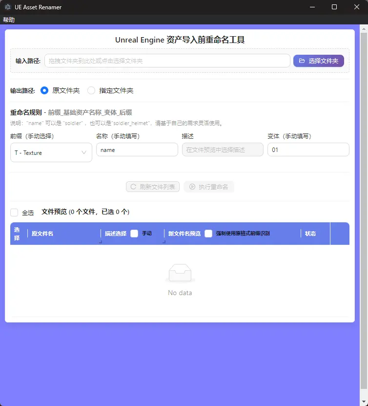

# UE5 Asset Renamer

Unreal Engine 5 资产导入前的批量重命名工具。

## 界面预览



## 功能

- 拖拽文件夹导入
- 命名格式：`前缀_基础资产名称_描述_变体`
- 自动检测贴图类型（BaseColor、Normal、Roughness 等）
- 批量重命名预览
- 自定义输出路径
- 列宽设置自动保存

## 技术栈

React 18 + TypeScript + Ant Design + Electron 28 + Vite 5

## 安装与运行

```bash
npm install
npm run dev
npm run build
```

## 使用方法

1. 选择或拖拽文件夹
2. 设置命名规则（前缀、名称、变体）
3. 为每个文件选择描述符
4. 预览新文件名
5. 执行重命名

## 命名规范

| 资产类型 | 前缀 | 示例 |
|---------|------|------|
| 贴图 | T | T_Soldier_D_01 |
| 静态网格 | SM | SM_Rock_01 |
| 骨骼网格 | SK | SK_Character_01 |
| 骨骼动画 | AS | AS_Weapon_01 |
| 音效 | S | S_Explosion_01 |

## License

GPLv2 License 2.0 or later
